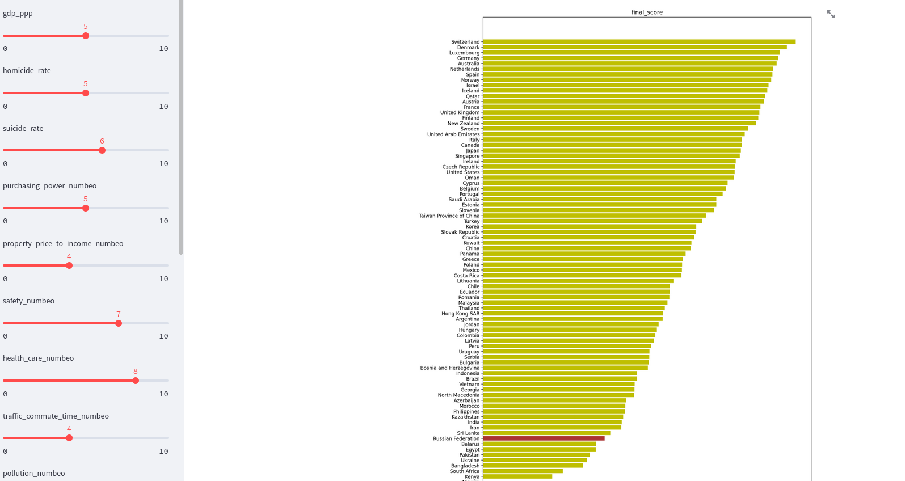

# country-comparison

### Цель.

Какую метрику придумаем такое место и займём

Данный репозиторий - попытка создать рейтинг стран на основании отдельных
показателей. Много циферок хорошо, но одна цифра понятней. При этом рейтинг не про то, где лучше номаду, а
скорее про то, где лучше гражданам в целом.

Конечный скор не претендует на объективность. Как говорил мой декан: `жизнь шире всех систем`.

 Таблица источников

| Показатель         | Год актуальности | Источник                                                                                                                       |
|--------------------|------------------|--------------------------------------------------------------------------------------------------------------------------------|
| gdp ppp_per_cap    | 2023             | https://www.imf.org/external/datamapper/PPPPC@WEO/OEMDC/ADVEC/WEOWORLD                                                         |
| homicide rate      | 2018             | https://dataunodc.un.org/content/homicide-rate-option-2                                                                        |
| numbeo             | 2023 mid-year    | https://www.numbeo.com/quality-of-life/rankings_by_country.jsp                                                                 |
| suicide rate       | 2019             | https://apps.who.int/gho/data/node.main.MHSUICIDEASDR?lang=en                                                                  |
| life expectancy    | 2019             | https://apps.who.int/gho/data/node.main.688                                                                                    |
| happiness index    | 2022             | https://worldhappiness.report/ed/2023/#appendices-and-data                                                                     |
| unesco objects     | 2023             | https://en.wikipedia.org/wiki/World_Heritage_Sites_by_country                                                                  |
| median age         | 2022             | https://population.un.org/wpp/Download/Files/1_Indicators%20(Standard)/EXCEL_FILES/1_Population/WPP2019_POP_F05_MEDIAN_AGE.xlsx |
| gini               | 2022 - частично  | https://data.worldbank.org/indicator/SI.POV.GINI/                                                                              |
| incarceration rate | 2023 mid-year    | https://www.prisonstudies.org/highest-to-lowest/prison_population_rate?field_region_taxonomy_tid=All                           |
| gender_gap         | 2021             | https://en.wikipedia.org/wiki/Global_Gender_Gap_Report                                                                          |
| press_freedom      | 2023             | https://rsf.org/en/index?year=2023                                                                                              |

 Описание показателей 

`gdp_ppp_per_cap` - есть 2 основных источника: IMF и WorldBank. Есть ещё CIA, но они выходят реже. WorldBank для РФ и
Украины при определении суммарного gdp опирается на внутреннюю статистику государств.
Видимо, чтобы быть ближе к реальности. Для подушевого gdp разница не такая уж большая. К тому же, расчёт паритета сам
по себе не обладает большой точностью. Я использую IMF, просто по традиции.
В рассчёт ВВП не входит теневая экономика. Он бы очень сдвинул показатели. Но я сомневаюсь, что кто-то в мире
может сделать этот расчё во-первых хорошо, во-вторых не ангажировано. 
Документ от IMF включает в себя года из будущего. Это, естественно, прогноз.  

`homicide rate` - устаревший. Но, по крайней мере, это ООН. Понятно, что статистику тоже можно обелить, выпиливая
случаи убийств в смежные области, например, в несчастные случаи. Или просто оставить пропавшими без вести.
Данные взяты из итерации 2022 года без изменений

`numbeo` - есть нюансы: данные берутся за последний год(по возможности), в странах различное покрытие интернетом, etc

`suicide rate` - устаревший, доковидный. Данные взяты из итерации 2022 года без изменений. Данные ВОЗ будут отличаться от
внутрероссийских из-за того, что они, видимо, включают смертность от «повреждений с неопределенными намерениями» 
(рубрики Y10-Y34 Международной классификации болезней и причин смерти). А также потому что это age-standardized статистика.
У РФ, кстати, [неплохое качество](https://www.who.int/teams/mental-health-and-substance-use/data-research/suicide-data-quality)
данных по мнению ВОЗ. 
Методология очень запутанная. Во многом опирается на estimations, иногда полученные на основе похожих стран.
Ну вы поняли...

Методология с сайта

Method of estimation:
The estimates are derived from the WHO Global Health Estimates (GHE) 2015. 
Detailed methods are available here, and summarized below. All-cause mortality rates by age and sex for WHO Member States
are derived from life tables which draw on UN World Population Prospects 2015 revision, 
recent and unpublished analyses of all-cause and HIV mortality for countries with high HIV prevalence,
vital registration data, and estimates of child mortality from UN Inter-agency Group for Child Mortality Estimation. 
Cause-of-death distributions are estimated from death registration data when available; 
assessed and adjusted for completeness and ill-defined categories. 
Selected specific causes are based on WHO and UN Interagency estimation processes, which made use of epidemiological studies, 
disease registers and notifications systems. Other causes of death for populations without useable death-registration 
data are estimated, drawing on updated IHME single-cause analyses from the Global Burden of Disease (GBD) 2015 study,
which made use of available death registration data as well as other sources of information on deaths,
covariate regression modelling, and patterns of causes of death for similar countries. These estimates represent the best 
estimates of WHO, computed using standard categories, definitions and methods to ensure cross-country comparability,
and may not be the same as official national estimates. 
Due to changes in input data and methods, GHE2015 are not comparable to previously published WHO estimates. 

`life expectancy` - оставил данные за 2019 год. Провайдеров данных много, есть и более поздние данные, но влияние Covid
очень существенное. Восстановление ОПЖ увидим в 2023 году, поэтому брать 2022 и, тем более 2021, смысла пока нет. Данные
ВОЗ основываются на статистике, предоставляемой странами-участницами программы VR (Vital Registration). Это 77 стран, 
что вполне достаточно для целей данного проекта. Для стран-участниц VR всё же делается оценки корректировки для старшего 
поколения из-за неполноты информации в данной группе. Но не думаю, что эти оценки могут существенно сдвинуть показатели.
Для стран вне VR данные делаются оценочно. 

`happiness index` - результаты отчёта 2023 года получены усреднением за 3 последних года (2020 - 2023),
хотя данные по отдельным годам также присутствуют. При этом данные за последние 3 года есть далеко не у всех стран.
Источник данных - опросы Gallup. В опросе учавствуют ~1000 респондентов на страну. 
Индекс рассчитывается усреднением оценок удовлетворённости респондентов своей жизнью по 10-бальной шкале. Есть также
ряд вспомогательных индексов, к. используются в попытках разложить базовый индекс на составляющие для того, чтобы 
объяснить, что именно привело к такому уровню удовлетворённости. Интересно, что под соц. поддержкой понимается не
пенсии или прочие пособия, а утвердительный ответ на вопрос
> If you were in trouble, do you have relatives or friends you can count on to help you whenever you need them, or not

Индекс коррупции тоже максимально странный. Таджикистан на 17 месте между Австрией и Бельгией.

`median age` - оставил данные за 2020 год. можно по-другому назвать молодость нации.
я взял равным 30 исключительно из субъективных соображений. Более молодые нации имеют иждивенцев внизу
половозрастной пирамиды, более старые вверху. Можно было бы взять 35 лет, но всё же у более молодых стран больше надежды.
Ссылка в источниках устарела, UN не смог в обратную совместимость - файл можно найти через гугл по названию. 2020 год, 
п.ч. статистика даётся по пятилеткам. В World Population Prospects 2022 они перешли к погодовой статистике. Для рассчёта
показателей фертильности, смертности, миграции UN использует переписи, опросы и статистику VR (Vital Registration).
Для медианного возраста методолгию найти не удалось 

`gini` - очень не полный. за 22 год всего 7 наблюдений. Заполняю предыдущими значениями. Зато, в отличии от данных,
у World Bank хорошее [описание методологии](https://databank.worldbank.org/metadataglossary/gender-statistics/series/SI.POV.GINI).
Источником данных служат национальные статистические агенста и собственные опросы World Bank. Для развитых стран 
используется `Luxembourg Income Study database`. Огранчения индекса хорошо описаны на страничке с методологией.
Пустые значения добираются из прошлых лет и со сторонних сайтов: WB не единственный источник.

`incarceration rate` - аккумулируется организацией World Prison Brief. Хостят базу ребята на серверах 
Birkbeck, University of London, степень аффиляци не понятна. Данные собираются с
> largely derived from governmental or other official sources

Файл разбивает UK на несколько субъектов и Боснию и Герцеговину. Заменяю взвешенной суммой по регионам, иначе 
метчинг плохо проходит

`gender_gap` - составитель Всемирный Экономический Форум. Есть и более поздние годы, но уже без РФ - 
поэтому использую 2021. Сам отчёт в pdf, поэтому приходится парсить wiki. 
Индекс составной и содержит 4 составляющих: экономическое участие, доступность обучения, здоровье,
политическая включённость. Источники: International Labour Organisation, ВОЗ, Всемирный Банк, Юнеско, ВЭФ.
Методологию можно посмотреть в Appendix B внутри отчёта - она расписана достаточно подробно.

  

 Критика показателей  
 

**Numbeo** отличный бейзлайн, но у него есть следующие недостатки

**Сбор данных numbeo:**

> Numbeo archives the values of its old data for historical purposes.
> By default, data older than 12 months is removed, but for popular cities,
> this time frame can be reduced to 3 months. If fresh data are not available,
> Numbeo may use data up to 18 months old, but only if our indicators suggest that inflation is low in that country. 

Дата актуальности в 1 год это хорошо, но хотелось бы посмотреть на то, как определяются популярные города. Пороги
скрыты, поэтому не понятно насколько это всё костыльно.
Они обмолвились об инфляции, но не понятно это внутренняя или долларовая. Я замечал, что колебания курса очень сильно
влияют на финальный скор.
- как они усредняют инфляцию по году?
- наблюдения, ближе к текущему дню, более весомые или просто берём среднее?

**Страновой индекс numbeo**

>To compile data for a country, we utilize all the entries (from all cities) to calculate average
> data for that country. It should be noted that this is different process than
> from calculating aggregated data for all cities in the country.
> Therefore, in calculating country-level data, we weigh each city by the number of contributors.
> As there are usually more inputs for a country than for a city, 
> the aggregate data shown at a country level generally consists of more data points. 
 
Скор страны это взвешенная сумма городов. Но ведь у стран разный уровень урбанизации. 
Деревенских опять забыли?

`Numbeo purchasing power index` - не учитывает количество бесплатных или условно бесплатных благ. Например,
оплата садика в РФ и Нидерландах отличается раз в 20. Высшее образование тоже мегатрата в некоторых странах. 
Также показатель не учитывает безработицу, размер пенсии или налог на пользование автомобилем.  

`Numbeo property to income index` - отражает ситуацию в моменте. Но не учитывает долю населения, имеющую 
недвижимость во владении. Или качество жилья, как таковое.

`Идеальный медианный возраст(distance_to_30_years)` - я взял равным 30 исключительно из субъективных соображений.
Более молодые нации имеют иждивенцев внизу половозрастной пирамиды, более старые вверху. Можно было бы взять 35 лет, но всё же у 
более молодых стран больше надежды. 

**Отклонённые показатели**

`Median Wealth per adult от Credit Suisse` - 3K$ для РФ не покрывает даже недвижимость. Хотя медианное благосостояние
действительно низкое. Сложно не поверить в теории заговора, глядя на эти цифры. 
upd: после краха CreditSuisse и включения в UBS статистика стала поадекватней. Но, потратив на поиск методологии около 
часа, я так и не смог найти: отчёт ссылается на другой отчёт HBS от OECD. Уже над статистикой из отчёта HBS проводятся 
какие-то манипуляции, описанные в отдельном paper. Статистика считается на основе финансовых показателей и стоимости
недвиги. При этом стоимость недвиги покрыта для не очень большого числа стран. Да и финансовыми показателями покрыта
только 51 страна. Для остальных используется `standard econometric technics`.  

`уровеь безработицы` - умеют считать нормально только развитые бюрократии, к. не так чтобы много. Возможо, и
они не умеют

### Визуальный интерфейс

### Ссылка для ознакомления

[Visit](https://pvgorshenin-country-comparison-main-ri29h5.streamlit.app)

### Сбор данных

В качестве базового набора стран использован список стран из numbeo. Набор стран разнится между источниками, 
но мэтчинг редких стран и разных написаний одной страны слишком трудоёмкий.

Сбор данных происходит в полурочном режиме внутри ветки
[making_data](https://github.com/PVGorshenin/country_comparison/tree/making_data)
Многие показатели выкладываются в виде excel-файлов. Поэтому труд на автоматизацию не факт, что окупится.
Внутри `making_data` [парсится](https://github.com/PVGorshenin/country_comparison/tree/making_data/get_data/parse), что доступно парсингу.
Excel файлы пинаются костылём в `data/input/<year>`.

Далее файлы обрабатываются в скриптах 
[здесь](https://github.com/PVGorshenin/country_comparison/tree/making_data/processing).
Финальный результат, сметчинных показателей хранится 
[здесь](https://github.com/PVGorshenin/country_comparison/blob/making_data/data/result/2023/). 
В main этот файл попадает без мёрджа через checkout из making_data.

### Запуск

Проект написан на **python** с использование  **streamlit** в качестве веб-интерфейса. 
Команда для установки
`pip install -e .`

и запуска

`streamlit run main.py`

web-интерфейс станет доступен по адресу `localhost:8501`

### Конфигурирование

Настройки передаются через [конфиг-файл](config.yaml). Здесь можно задать базовые веса для коэффециентов.
Данные веса будут использованы в качестве дефолтных и далее могут быть измененины в web-интерфейсе. 

Перед запуском нужно указать в конфиге `res_filepath`. В эту папку выгрузится картинка с финальным
положением стран.

### Методология

Каждый параметр маппится в интервал `[0, 100]` с помощью `MinMax scaling`. Далее показатели 
суммируются с весами из [конфиг-файла](config.yaml) (для локального запуска) или с весами с формы.
В web-интерфесе границы бегунка находятся в интервале `[0, 10]` для удобства. 
Но под капотом веса приводятся к интервалу `[0, 1]`.
Полученный результат повтор маппится в `[0, 100]`

Некоторые показатели, например `gdp_ppp` содержат выбросы(мин-макс сильно удалённые от основной массы точек).
Лечится обрезанием по квантилям. Уникальная возможность обрезать Норвегию или Люксембург в поле `feature_clips` 
конфига.

### Текущие показатели

`
gdp_ppp, homicide_rate, suicide_rate, purchasing_power_numbeo, property_price_to_income_numbeo,
safety_numbeo, health_care_numbeo, traffic_commute_time_numbeo, pollution_numbeo, climate_numbeo, 
life_expectancy, happiness, unesco_objects, distance_to_30_years, gini, incarceration_rate`

### Search a buddie

Алгоритм ищет ближайшую страну в признаковом пространстве по евклидовой метрике.
Исходная страна указывается в (`config[country_to_highlight]`). 
Данный алгоритм - это попытка найти самую приближённую страну к рассматриваемой. 
Ручка для включения - поле `is_buddie_highlight` в конфиге.
